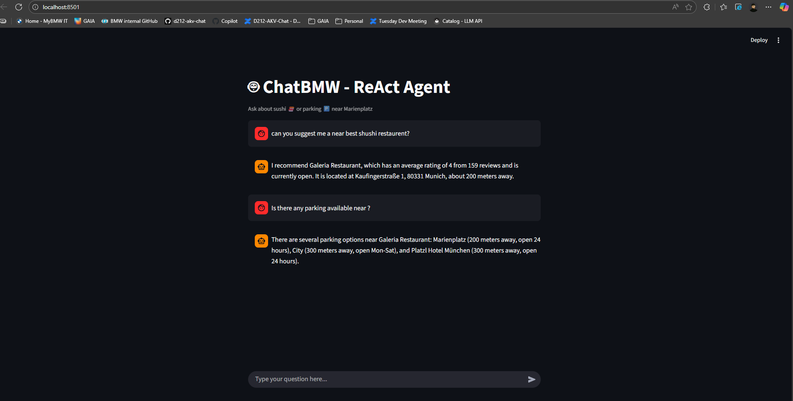

# 🤖 ChatBMW – ReAct Agent System

### Overview
ChatBMW is an intelligent conversational microservice built using **LangChain's ReAct framework** and **OpenAI GPT-4o-mini**.  
It enables users to explore nearby **sushi restaurants** and **parking garages** in **Marienplatz, Munich**, using a multi-turn conversational interface (CLI or Streamlit).

The agent uses **tools** to fetch structured data from local JSON files, reasons over it, and maintains **memory** to understand context across multiple turns — all while simulating human-like reasoning steps (Thought → Action → Observation → Answer).

---

## 🧱 System Architecture
**High-level flow:**
```
User (CLI / Streamlit)
        ↓
ReAct Agent (LangChain + GPT-4o-mini + Memory)
        ↓
Tools Layer [sushi | parking | details]
        ↓
Local Datasets [sushi.json | parking.json]
        ↓
Response → Displayed to User
```

You can find the visual diagram in:  
📄 `Architecture_Diagram.pdf`

---

## ⚙️ Project Setup

### 1️⃣ Clone the Repository
```bash
git clone <your-repo-url>
cd prototype
```

### 2️⃣ Create a Virtual Environment
#### 🐍 Windows
```bash
python -m venv .venv
.venv\Scripts\activate
```

#### 🐧 macOS / Linux
```bash
python3 -m venv .venv
source .venv/bin/activate
```

### 3️⃣ Install Dependencies
```bash
pip install -r requirements.txt
```

### 4️⃣ Setup Environment Variables
Create a file named `.env` in the root directory:
```
OPENAI_API_KEY=your_api_key_here
LANGSMITH_TRACING=false
```

---

## 🚀 Running the Project

### ▶️ Option 1: Command-Line Interface
Run:
```bash
python src/react_agent.py
```

**Example Interaction:**
```
🤖 ChatBMW Welcomes you

User: show sushi places near Marienplatz
Agent: Sasou, Galeria Restaurant, Shaokao Asian Grill&Wine, and Secret Garden.

User: which one is open now?
Agent: Sasou and Galeria Restaurant are currently open.

User: how far is Sasou?
Agent: Sasou is located 65 meters away from Marienplatz.
```

---

### 🖥️ Option 2: Streamlit Web UI
Run the web interface:
```bash
streamlit run src/chat_ui.py
```

Then open the browser (automatically opens at `http://localhost:8501`).

**Example Output:**
```
🤖 ChatBMW - ReAct Agent
Ask about sushi 🍣 or parking 🅿️ near Marienplatz

User: show parking places
Assistant: Marienplatz, City, and Platzl Hotel München are nearby.
```

---

## 🧩 Key Design Components

| Component | Description |
|------------|-------------|
| **ReAct Agent** | Implements the ReAct reasoning loop using LangChain + GPT-4o-mini |
| **Memory (ConversationBufferMemory)** | Stores chat history to handle multi-turn context |
| **Tools Layer** | 3 tools – `sushi`, `parking`, and `details` – that query structured JSON data |
| **Data Layer** | Local JSON datasets (`sushi.json`, `parking.json`) loaded via `data_loader.py` |
| **UI Layer** | Streamlit chat interface for interactive exploration |
| **LangSmith Integration** | Optional tracing for workflow visualization (disabled by default) |

---

## 💬 Example Queries

| User Query | Example Response |
|-------------|------------------|
| “Show sushi places near Marienplatz.” | Lists nearby sushi restaurants. |
| “Which ones are open now?” | Identifies open restaurants. |
| “Show parking near Marienplatz.” | Lists nearby parking garages. |
| “What is the price for City Parking?” | Returns price & availability. |
| “What payment methods are accepted there?” | Retrieves details of the mentioned location. |

---

## 📊 Datasets
- **sushi.json** → Contains sushi restaurant info (name, address, rating, distance, hours, etc.)  
- **parking.json** → Contains parking garage info (name, address, price, availability, distance, etc.)

---

## 🧠 How It Works Internally

1. **User sends a query** via CLI or Streamlit.
2. **ReAct Agent** receives the query and reasons about which **tool** to call.
3. The selected **tool** (e.g., `sushi`, `parking`, `details`) fetches data from the dataset.
4. The **agent observes** the tool output, interprets it, and composes a natural language response.
5. The **ConversationBufferMemory** keeps the entire chat history for contextual follow-ups.
6. The **final answer** is displayed back to the user.

---

## 🧾 Requirements
```
openai
langchain==0.3.6
langchain-core==0.3.15
langchain-openai
langchain-community
python-dotenv
streamlit
```

---

## 🧑‍💻 Contributors
- **Jajula Sai Venkatesh**  
  Master's in AI & Data Science – Deggendorf Institute of Technology  
  Developer of ChatBMW ReAct Agent Prototype

---

## 🏁 Summary
✅ Multi-turn conversational ReAct Agent  
✅ Uses LangChain + OpenAI + Local Datasets  
✅ Includes CLI and Streamlit interfaces  
✅ Demonstrates reasoning, memory, and tool-based data retrieval  

---
## OUTPUT



